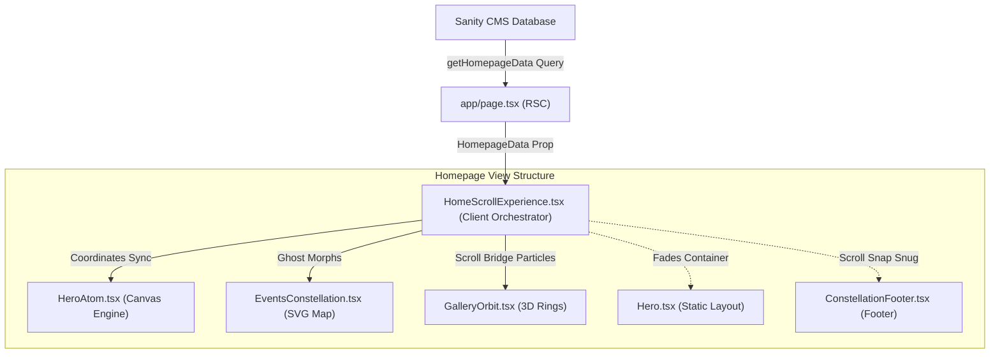

# NSS Clubs Homepage Technical Architecture & Codebase Guide

This document provides a highly detailed, comprehensive breakdown of the frontend architecture, state machines, math utilities, canvas animations, CSS keyframes, and scroll behaviors that power the interactive homepage of the **NSS Clubs** website.


---

## 📂 Homepage Codebase File Structure & Dependency Tree

Below is the directory tree of the components, entry points, styles, and footers that compose the homepage visual and interactive experience:

```
club-website/
├── app/
│   └── page.tsx               # Next.js Server Component (Fetches HomepageData from Sanity CMS)
└── components/
    ├── HomeScrollExperience.tsx # Master Client Orchestrator (State machine, transitions, snaps, morphs)
    ├── Hero.tsx               # Static banner container & background highlights (.hero-atom-origin anchors)
    ├── HeroAtom.tsx           # Interactive Canvas (DPI-scaled atom nucleus & orbiting club electrons)
    ├── EventsConstellation.tsx # SVG constellation overlay (Y-staggered cascade dots & lines)
    ├── home/
    │   ├── GalleryOrbit.tsx   # 3D rotating photo carousel & interactive scroll-bridge particles
    │   └── GalleryOrbit.module.css # Scoped CSS keyframes (collapse, guides, clockwise rotations)
    └── layout/
        └── ConstellationFooter.tsx # Constellation-themed footer with twinkling SVG micro-animations
```

### 🛰️ Core State & Data Flow Pipeline

The diagram below outlines how Sanity CMS content and interactive animation states flow downward through these components:



---


## 🏛️ High-Level Architecture & Page Flow

The homepage relies on a hybrid static-dynamic rendering model. Dynamic content is fetched from Sanity CMS, while complex interactive transitions, canvas overlays, and SVG constellations are managed on the client side using a central state machine.

### 🔌 Entry Point: [app/page.tsx](file:///c:/Projects/NSS/club-website/app/page.tsx)
- **Type**: Next.js React Server Component (RSC).
- **Purpose**: Fetches singleton homepage data via the GROQ query `getHomepageData()` from Sanity CMS.
- **Handling**:
  - If no data is returned, it renders a fallback message asking the administrator to publish the Homepage document in Sanity Studio.
  - If data is available, it feeds it as the `data` prop to the client-side orchestrator: `<HomeScrollExperience data={data} />`.

---

## 🔄 The Orchestrator: [components/HomeScrollExperience.tsx](file:///c:/Projects/NSS/club-website/components/HomeScrollExperience.tsx)

This file contains the master component coordinating page layout, custom snap-scroll behaviors, coordinate mappings, and intersection observers. It manages **123KB** of layout state and animations.

### 1. The Scroll State Machine (Phases)
The page scroll position is discretized into a state machine defined by the `Phase` type:
```typescript
type Phase = "hero" | "animating" | "clubs" | "zooming" | "zoomed" | "about" | "events" | "gallery";
```
- `"hero"`: User is at the top banner. The canvas `HeroAtom` floats in the right column (on desktop) or center (on mobile).
- `"animating"`: A programmatic snap-scroll transition is actively scrolling the page window. All scroll inputs are temporarily blocked.
- `"clubs"`: User is in the Clubs showcase. The canvas `HeroAtom` aligns with the left column anchor, displaying the 6 interactive club electrons.
- `"zooming"`: The user has clicked a node, triggering a scale-up transition of the canvas atom toward the screen center.
- `"zoomed"`: The camera is zoomed into the selected club. The detailed holographic card slides in from the right.
- `"about"`: The canvas atom has dissolved into the static HTML solar system. Panels (`Our Origin`, `President Message`, `Our Vision`) reveal themselves as the user scrolls.
- `"events"`: The HTML solar system exhales, fading out its elements, and cascades down into the SVG constellation pattern.
- `"gallery"`: The SVG constellation nodes collapse into orbit slots, transitioning into the counter-rotating photo rings.

---

### 2. Math & Easing Utilities
To ensure butter-smooth transitions across different screen resolutions, several math helpers are used:
- **`lerp(a, b, t)`**: Linear interpolation. Computes `a + (b - a) * t`. Used for floating coordinate paths, canvas scales, and color mixing.
- **`clamp01(v)`**: Restricts a value between `0` and `1`.
- **`easeInOutQuart(t)`**: A quartic bezier easing function. Starts slow, accelerates, and decelerates near completion. Used for snapping transitions.
  $$\text{easeInOutQuart}(t) = \begin{cases} 8t^4 & \text{if } t < 0.5 \\ 1 - \frac{(-2t + 2)^4}{2} & \text{otherwise} \end{cases}$$
- **`hexToRgb(hex)`**: Converts hex color strings into an `{r, g, b}` object by utilizing bitwise shift operations (`>>`).
- **`mixHex(a, b, t)`**: Computes the interpolated RGB color between two hex colors. Used during the dynamic event-to-gallery particle morphs.

---

### 3. Central Snap-Scroll Mechanics (`wheel` & `touchmove`)
Traditional browser scrolling is overridden in certain sections to enforce smooth, responsive section snaps.
- **Cooldowns**: Snapping transitions are rate-limited via `lastTransitionTimeRef` (700ms threshold) to prevent multiple triggers from mouse-wheel flicks.
- **Directional Snapping Triggers**:
  - `hero` $\rightarrow$ scroll down $\rightarrow$ triggers snap to `clubs` section.
  - `clubs` $\rightarrow$ scroll up $\rightarrow$ snaps to `hero`; scroll down $\rightarrow$ snaps to `about`.
  - `about` $\rightarrow$ scroll up $\rightarrow$ snaps to `clubs`; scroll down past the bottom threshold $\rightarrow$ snaps to `events`.
  - `events` $\rightarrow$ scroll down past trigger point $\rightarrow$ snaps to `gallery`.
- **Handoff Logic (`releaseEventsHandoff`)**:
  Allows the page to release custom scrolling and revert to natural, smooth browser scrolling when the user enters the footer/gallery sections.

---

### 4. Floating Canvas Coordination (The "Tick" Loop)
A central `requestAnimationFrame` loop drives the floating canvas:
1. Calculates the bounding rects of the static layout anchors (`.hero-atom-origin` and `clubsAnchorRef`).
2. Interpolates the absolute coordinates (`cx`, `cy`) and scaling factor of the canvas container based on `atomProgressRef` (Hero $\leftrightarrow$ Clubs) and `aboutProgressRef` (Clubs $\leftrightarrow$ About).
3. Applies CSS styles:
   - `floatingRef.style.transform = "translate(x, y)"`
   - `canvasWrapRef.style.transform = "scale(s)"`
4. Gradually fades out the canvas opacity (`opacity = 1 - aboutProgressRef.current`) past `55%` of the "About" section transition. This allows a seamless handoff to the static HTML solar system planets.

---

### 5. Holographic Projector Beam Simulation
When a club is selected, a connection line projects from the "nucleus" to the sliding card:
- **Points Calculated**:
  - `x1, y1`: Coordinate of the canvas nucleus (source) located at $18\%$ screen width, $50\%$ screen height.
  - `x2, y2`: Bounding top-left coordinate of the card wrapper.
  - `x3, y3`: Bounding bottom-left coordinate of the card wrapper.
- **Rendering**: Draws an SVG polygon filled with a linear gradient of the club's specific accent color (`#projector-beam-grad`). A pinging circle is drawn at the source pointer.

---

### 6. Solar System to Constellation Ghost Particle Morphs
During the `events` phase transition, 7 static HTML planets in the "About" section must morph into stardust dots in the SVG constellation background.
- **`PLANET_DOT_MORPHS` Mapping Table**:
  - Mercury $\rightarrow$ Dot `0` (Anchor, Blue)
  - Venus $\rightarrow$ Dot `5` (Background, Blue)
  - Earth $\rightarrow$ Dot `2` (Anchor, Blue)
  - Sun $\rightarrow$ Dot `4` (Gold, Sun Echo)
  - Mars $\rightarrow$ Dot `1` (Anchor, Blue)
  - Jupiter $\rightarrow$ Dot `3` (Anchor, Blue)
  - Saturn $\rightarrow$ Dot `12` (Background, Blue)
- **`updateMorphGhosts(progress)`**:
  - Instantiates temporary floating divs ("ghosts") aligned absolute to the viewport.
  - Obtains `from` coordinates from HTML elements (`#about .p-venus`, etc.) and `to` coordinates from the SVG viewbox projection.
  - Interpolates size, color, and positions in screen coordinates.
  - Once progress completes, the ghosts fade out, and the corresponding SVG dots are faded in.

---

## ⚛️ The Interactive Engine: [components/HeroAtom.tsx](file:///c:/Projects/NSS/club-website/components/HeroAtom.tsx)

This component implements a high-performance HTML5 Canvas rendering engine which visualizes the atomic structure representing the clubs.

### 1. High DPI Canvas Rendering
Standard displays look blurry when canvas elements scale up. To prevent this, the component dynamically reads device pixel ratio (`DPR`) up to `4.0` (razor-sharp scaling when zoomed):
```typescript
const DPR = Math.min(Math.max(window.devicePixelRatio || 1, 2) * 2, 4);
canvas.width = CANVAS_SIZE * DPR;
canvas.height = CANVAS_SIZE * DPR;
ctx.scale(DPR, DPR);
```

### 2. Orbit Math and Electron Trails
- **Orbits**: Rendered using `ctx.ellipse()` with variable eccentricity:
  - Radius X: `200px` (widen factor applied up to $1.8\times$ during transit).
  - Radius Y: `67px` (ratio creating a 3D tilted plane).
  - Tilt Angles: `-60deg`, `0deg`, and `60deg` respectively.
- **Rotations**: Driven by reference-based angle offsets that sync with the snap scroll.
- **Trails**: A `createLinearGradient` is drawn behind moving electrons, tracking backward from their current angle direction:
  $$\vec{v}_{\text{trail}} = - (\cos(\theta_{\text{trail}}), \sin(\theta_{\text{trail}})) \times \text{length}$$

### 3. Click and Hover Raycast Collision Detection
Canvas objects do not have DOM listeners. Interactive click/hover detection is implemented using radial coordinate distance checks within the event listener bounding boxes:
- **Nucleus Detection**:
  $$\text{distance} = \sqrt{(x - x_{\text{nucleus}})^2 + (y - y_{\text{nucleus}})^2} < 40\text{px}$$
- **Electron Detection**:
  $$\text{distance} = \sqrt{(x - x_{\text{electron}})^2 + (y - y_{\text{electron}})^2} < 30\text{px}$$
- Cursor styling shifts to `pointer` when hovering over any interactive node.

### 4. Morphing Nodes (Electron $\rightarrow$ Planet)
As scroll transition progresses, the canvas transforms the electrons into structured planets (`drawMorphingNode` function):
- **Phase 1 ($t \in [0.0, 0.35]$)**: Electrons expand, trails stretch, and base colors start interpolating.
- **Phase 2 ($t \in [0.35, 0.65]$)**: Crossfade is executed. The blue metallic electron sheens fade out, and 3D textured planet rings and shadows emerge.
- **Phase 3 ($t \in [0.65, 1.0]$)**: Planets settle into fixed horizontal positions, and hover atmospheric glows are initialized.

---

## 🌌 The Visual Transition: [components/EventsConstellation.tsx](file:///c:/Projects/NSS/club-website/components/EventsConstellation.tsx)

After the solar system fades out, it transitions into a background constellation map.

### 1. Structure of Constellation
- **Dots**: 18 hardcoded points (`DOTS` array) distributed across 3 vertical Y-bands:
  - Top 30% (y: 0–180): Dense stardust.
  - Middle 40% (y: 180–420): Sparse connections.
  - Bottom 30% (y: 420–600): Outer anchors.
  - Kinds: `anchor` (diameter 5.6px, planet echoes), `gold` (diameter 4px, sun echo), `bg` (diameter 3px, stardust).
- **Lines**: 11 vectors (`LINES` array) connecting active nodes.

### 2. Y-Staggered Delay Animation (The "Exhale" Effect)
To simulate planetary energy expanding and settling down, dots emerge in a top-down cascade.
- **Sorting**: Coordinates are sorted ascendingly by Y-position (`cy` coordinate).
- **Stagger**:
  - **Desktop**: 120ms delay increment per sorted dot position. Lines begin drawing after $60\%$ of dots emerge (1.2s delay).
  - **Mobile**: 60ms delay increment. Lines begin drawing after 0.6s.

### 3. Line Draw Animation Keyframes
Lines use `stroke-dashoffset` tricks to simulate paths tracing outward:
```css
@keyframes ec-line-draw {
  from { stroke-dashoffset: var(--ec-dash-len); opacity: 0.22; }
  to   { stroke-dashoffset: 0; opacity: 0.22; }
}
```

---

## 💫 3D Space Orbit: [components/home/GalleryOrbit.tsx](file:///c:/Projects/NSS/club-website/components/home/GalleryOrbit.tsx)

The final section is an orbital gallery where image frames circle around a central nucleus.

### 1. Ring Configuration and Dimensions
- **Inner Ring**: 3 image cards placed at `270deg`, `30deg`, and `150deg`. Rotation duration: `34s`.
- **Outer Ring**: 3 image cards placed at `90deg`, `210deg`, and `330deg`. Rotation duration: `48s` (counter-clockwise).
- **Radius**: Calculated dynamically using `getResponsiveRadius` to maintain layout ratios on all screen widths.

### 2. The Interactive Scroll-Bridge Particle System
As the user scrolls between the Events grid and the Gallery, a visual bridge forms:
- **Source coordinates**: Drawn from 6 key constellation dots (`BRIDGE_SOURCE_POINTS`).
- **Target coordinates**: Calculated dynamically based on the current responsive radii and angles of the rotating orbit slots.
- **Particle Flying Paths**: Particles fly along calculated SVG path curves (`polyline`) connecting source dots to targets. Speed, scale, and opacity fade out smoothly as the scroll progress approaches `100%`.

---

## 🎨 Global Styling: [components/home/GalleryOrbit.module.css](file:///c:/Projects/NSS/club-website/components/home/GalleryOrbit.module.css)

Contains specialized animations that handle structural reveals without Javascript overhead.

### 1. CSS Keyframe Animations
- **`collapseToOrbit`**:
  Initializes scale at $0.2$, translating photo cards from collapse coordinates (`--collapse-x`, `--collapse-y`), and transforms them onto their designated rotation radius.
- **`orbitClockwise` / `orbitCounterClockwise`**:
  Performs continuous 3D rotations from `0deg` to `360deg` / `-360deg`.
- **`nucleusReveal`**:
  Scales up the golden center nucleus with a springy cubic-bezier overshoot curve:
  ```css
  animation: nucleusReveal 0.95s cubic-bezier(0.16, 1, 0.3, 1) 0.8s forwards;
  ```
- **`linesCollapse`**:
  Shrinks the background stardust line connections down to $22\%$ scale, fading them out once they enter the orbit stage boundary.

---

## ⚡ Performance Optimization Summary
1. **RequestAnimationFrame throttling**: The main ticking loop in `HomeScrollExperience` skips redundant frames if elapsed millisecond increments are below `14ms` (~70 FPS lock).
2. **GPU Rasterization**: Critical variables like canvas translate offsets and scale transforms use `translate3d` to force GPU-accelerated layer rendering.
3. **Passive Event Listeners**: Touch and Wheel listeners specify `{ passive: false }` or `{ passive: true }` strictly where appropriate to optimize browser scrolling performance.
4. **Reduced Motion Media Queries**: Both CSS stylesheets and JavaScript event hooks listen to `prefers-reduced-motion: reduce` and disable orbital rotations, line collapse scripts, and structural keyframes automatically to ensure accessibility compliance.
