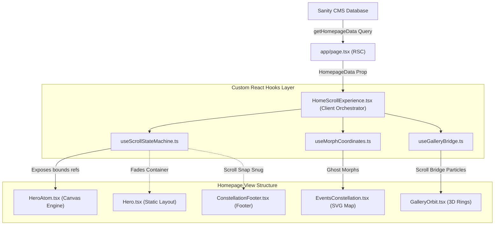

# NSS Clubs Homepage Technical Architecture & Codebase Guide

This document provides a highly detailed, comprehensive breakdown of the frontend architecture, state machines, math utilities, canvas animations, CSS keyframes, and scroll behaviors that power the interactive homepage of the **NSS Clubs** website.


---

## 📂 Homepage Codebase File Structure & Dependency Tree

Below is the directory tree of the components, hooks, entry points, styles, and footers that compose the homepage visual and interactive experience:

```
club-website/
├── app/
│   └── page.tsx               # Next.js Server Component (Fetches HomepageData from Sanity CMS)
├── hooks/
│   ├── useScrollStateMachine.ts # Scroll state tracker, DOM layout cache, and snap listeners
│   ├── useMorphCoordinates.ts # GPU-accelerated absolute coordinates ghost planet morpher
│   └── useGalleryBridge.ts    # Handoff flag orchestrator for events-to-gallery scroll bridges
└── components/
    ├── HomeScrollExperience.tsx # Master Client Orchestrator (Coordinates sub-hooks and canvas container)
    ├── Hero.tsx               # Static banner container (Exposes HeroHandle forwardRef to hooks)
    ├── HeroAtom.tsx           # Interactive Canvas (DPI-scaled atom nucleus, inverse matrix cursor checking)
    ├── EventsConstellation.tsx # SVG constellation overlay (Receives svgRef to expose bounds details)
    ├── home/
    │   ├── GalleryOrbit.tsx   # 3D rotating photo carousel & interactive scroll-bridge particles
    │   └── GalleryOrbit.module.css # Scoped CSS keyframes (collapse, guides, clockwise rotations)
    └── layout/
        └── ConstellationFooter.tsx # Constellation-themed footer with twinkling SVG micro-animations
```

### 🛰️ Core State & Data Flow Pipeline

The diagram below outlines how Sanity CMS content, custom hooks, and interactive animation states flow downward through these components:




---


## 🏛️ High-Level Architecture & Page Flow

The homepage relies on a hybrid static-dynamic rendering model. Dynamic content is fetched from Sanity CMS, while complex interactive transitions, canvas overlays, and SVG constellations are managed on the client side using a central state machine.

### 🔌 Entry Point: [app/page.tsx](file:///c:/Projects/NSS/club-website/app/page.tsx)
- **Type**: Next.js React Server Component (RSC).
- **Purpose**: Fetches singleton homepage data via the GROQ query `getHomepageData()` from Sanity CMS.
- **Handling**:
  - If no data is returned, it renders a fallback message asking the administrator to publish the Homepage document in Sanity Studio.
  - If data is available, it feeds it as the `data` prop to the client-side orchestrator: `<HomeScrollExperience data={data} />`.

---

## 🔄 The Master Orchestrator: [components/HomeScrollExperience.tsx](file:///c:/Projects/NSS/club-website/components/HomeScrollExperience.tsx)

`HomeScrollExperience.tsx` acts as a lightweight layout shell, routing dynamic props from Sanity CMS and wiring refs. All scrolling state machines, DOM layout calculations, and coordinate morph maps are completely separated into custom React Hooks for clean architectural boundaries.

---

## ⚓ Modular Hooks & Architectural Decoupling

### 1. [hooks/useScrollStateMachine.ts](file:///c:/Projects/NSS/club-website/hooks/useScrollStateMachine.ts)
Exposes the master scroll phase tracker, keyboard/touch event managers, and a centralized scroll layout measurement cache.
- **`LayoutCache` Interface**:
  To prevent **layout thrashing** (excessive style reflows caused by calling `getBoundingClientRect()` within a `requestAnimationFrame` loop), the hooks cache element dimensions and absolute page offsets once during geometric changes:
  ```typescript
  interface LayoutCache {
    windowWidth: number;
    windowHeight: number;
    scrollX: number;
    scrollY: number;
    heroAnchor: PageRect | null;
    clubsAnchor: PageRect | null;
    aboutAnchor: PageRect | null;
    cardWrapper: PageRect | null;
    clubsSectionTop: number;
    aboutSectionTop: number;
    aboutSectionHeight: number;
    eventsSectionTop: number;
    eventsSectionHeight: number;
    gallerySectionTop: number;
    planets: Record<string, { x: number; y: number; size: number } | null>;
    constellationSvg: PageRect | null;
  }
  ```
- **Batched DOM Measurements**:
  - **`updateLayoutGeometry()`**: Called inside a `ResizeObserver` listener and window `resize` handler. Updates coordinates and bounding rect values in `layoutCacheRef` without triggering React state re-renders.
  - **`computeScrollProgress()`**: Reads cached top offsets to calculate standard linear scroll position values (`atomProgressRef`, `aboutProgressRef`, and `eventsMorphRef`). Updates discrete React states (`clubsTextVisible` and `activeAboutNode`) strictly on threshold crossings.
  - **`initializeFromScroll()`**: Runs on the first frame to inspect scroll position and sync phases, preventing visual jumps if the user refreshes mid-page.
  - **`getProjectorAndTargetCoordsCached(...)`**: A static calculation method that uses cached bounds to locate target endpoints for the holographic beam, bypassing DOM reads entirely.

- **Snapping Bindings**:
  Automatically adds scroll snapping classes (`snap-y`, `snap-mandatory`, `scroll-smooth`) to `document.documentElement` during mount.

- **Component Ref Handoffs**:
  - **`HeroHandle`**: [components/Hero.tsx](file:///c:/Projects/NSS/club-website/components/Hero.tsx) is refactored using `forwardRef` and `useImperativeHandle`. It exposes a `getAtomOrigin()` method that returns the first visible `.hero-atom-origin` container (desktop or mobile). The hooks call this to get the canvas coordinates without raw selector querying.
  - **`svgRef`**: Passed to [components/EventsConstellation.tsx](file:///c:/Projects/NSS/club-website/components/EventsConstellation.tsx) to expose the background viewBox bounds to `useScrollStateMachine`.

---

### 2. [hooks/useMorphCoordinates.ts](file:///c:/Projects/NSS/club-website/hooks/useMorphCoordinates.ts)
Manages the absolute coordinate calculations and DOM updates for the 7 planet "ghosts" that bridge the transition from the solar system to the background SVG constellation.
- **`updateMorphGhosts(progress: number)`**:
  - Called directly from the main rAF loop.
  - Skips React virtual DOM diffing and updates styles directly (`ghost.style.transform = translate3d(...)`).
  - Utilizes **`translate3d(x, y, 0)`** instead of `left`/`top` offsets to trigger GPU composition layers and prevent layout reflows during frame updates.
  - Maps planet positions from `layoutCacheRef` to SVG coordinate equivalents (`scaleX = svgRect.width / 1000`, `scaleY = svgRect.height / 600`).
- **`morphedDotIds`**: State variable holding IDs of hidden constellation dots, letting individual SVG circles fade in only as ghost particles land.

---

### 3. [hooks/useGalleryBridge.ts](file:///c:/Projects/NSS/club-website/hooks/useGalleryBridge.ts)
A lightweight state wrapper handling transition handoffs between the SVG constellation and the rotating gallery:
- **`checkGalleryHandoff()`**: Monitors morph progress. Once events morph reaches $1.0$, it sets the gallery handoff flag `galleryHandoffRef.current = true`, freeing the scroll snapping container to allow natural scroll progression into the gallery.

---

### 4. Math & Easing Utilities
To ensure butter-smooth transitions across different screen resolutions, several math helpers are used:
- **`lerp(a: number, b: number, t: number): number`**: Linear interpolation. Computes $a + (b - a) \times t$. Used for floating coordinate paths, canvas scales, and color mixing.
- **`clamp01(v: number): number`**: Restricts a value between `0` and `1`.
- **`easeInOutQuart(t: number): number`**: A quartic bezier easing function. Starts slow, accelerates, and decelerates near completion. Used for snapping transitions.
  $$\text{easeInOutQuart}(t) = \begin{cases} 8t^4 & \text{if } t < 0.5 \\ 1 - \frac{(-2t + 2)^4}{2} & \text{otherwise} \end{cases}$$
- **`hexToRgb(hex: string): { r: number; g: number; b: number }`**: Converts hex color strings into an `{r, g, b}` object by utilizing bitwise shift operations (`>>`).
- **`mixHex(a: string, b: string, t: number): string`**: Computes the interpolated RGB color between two hex colors. Used during the dynamic event-to-gallery particle morphs.

---


## ⚛️ The Interactive Engine: [components/HeroAtom.tsx](file:///c:/Projects/NSS/club-website/components/HeroAtom.tsx)

This component implements a high-performance HTML5 Canvas rendering engine which visualizes the atomic structure representing the clubs.

### 1. High DPI Canvas Rendering
Standard displays look blurry when canvas elements scale up. To prevent this, the component dynamically reads device pixel ratio (`DPR`) up to `4.0` (razor-sharp scaling when zoomed):
```typescript
const DPR = Math.min(Math.max(window.devicePixelRatio || 1, 2) * 2, 4);
canvas.width = CANVAS_SIZE * DPR;
canvas.height = CANVAS_SIZE * DPR;
ctx.scale(DPR, DPR);
```

### 2. Math & Easing Utilities
- **`easeOutExpo(t: number)`**: Decelerates scaling smoothly.
- **`easeInOutCubic(t: number)`**: Performs standard S-shaped interpolation.
- **`easeOutQuart(t: number)`**: Used to create quick snapping animations.
- **`shortestAngle(start: number, end: number): number`**: Returns the shortest angular distance between two polar angles in radians. Used to orient electrons properly during the Settle Phase.
  $$\text{diff} = (\text{end} - \text{start}) \pmod{2\pi}$$

---

### 3. Detailed Canvas Rendering Functions Directory
- **`drawOrbit(rx: number, ry: number, angleDeg: number, orbitFade: number, morphT: number): void`**
  - **Purpose**: Draws the elliptical orbit path for electrons.
  - **Math**: Scales ellipse width by $1 + \text{morphT} \times 0.8$ during transits. Interpolates color channels from blue `rgb(2, 59, 142)` to gold `rgb(212, 163, 115)` as orbits dissolve.
- **`getPos(rx: number, ry: number, angleDeg: number, theta: number, morphT: number): { x: number; y: number }`**
  - **Purpose**: Computes the 2D Cartesian $(x,y)$ coordinates for a moving electron along its eccentric 3D orbit plane at polar angle $\theta$.
- **`drawElectron(x: number, y: number, alpha: number, trailLength: number, trailAngle: number): void`**
  - **Purpose**: Draws a metallic-sheened electron sphere.
  - **Rendering**: Draws a radial gradient shadow, draws the base color, overlays a linear gradient sheen, adds a specular circular highlight, and renders motion trails.
- **`drawNucleus(x: number, y: number, r: number, brightenT: number): void`**
  - **Purpose**: Draws the golden center nucleus representing the Executive Team.
  - **Rendering**: Adds a glow shadow (`ACCENT_GOLD` or `#FF8C00`), a warm-shifting linear metal gradient, a dark rim border gradient, and a specular highlight.
- **`drawSun(x: number, y: number, r: number, morphT: number): void`**
  - **Purpose**: Draws the fully formed sun in the solar system.
  - **Rendering**: Multiplies radius by a sinusoidal pulse factor: $r \times (1 + \sin(\text{time} \times 0.04) \times 0.02)$.
- **`drawPlanetOrbitRing(sunX: number, sunY: number, planetX: number, orbitAlpha: number): void`**
  - **Purpose**: Draws a dashed circular path ring representing gravity wells around the sun on electron hover.
- **`drawPlanet(x: number, y: number, r: number, baseColor: string, accent: string, alpha: number, hasRing: boolean, glowColor: string): void`**
  - **Purpose**: Draws a detailed 3D textured planet.
  - **Rendering**: Renders outer atmospheric radial glow, soft shadows, clips surface bands, draws rings (using 3D ellipse rotations), and adds specular highlights.
- **`drawBackgroundStars(alpha: number): void`**
  - **Purpose**: Twinkles stars in the canvas background. Uses individual star offsets and phase rates.
- **`drawMorphingNode(...): void`**
  - **Purpose**: Directs the gradual shape, color, and scale crossfade from electron to planet over 3 stages.
- **`frame(timestamp: number): void`**
  - **Purpose**: The core requestAnimationFrame ticking callback. 
  - **Logic**: Throttles frame rates, updates hover progress variables, applies CSS Y-rotations/tilts, clears frame bounds, and dispatches draws in the correct layout layer order.
  - **Perspective Skew Protection**:
    3D CSS rotations are applied to the canvas container during transit phases to create a spinning sphere. To prevent Y-perspective distortion from altering `getBoundingClientRect()` bounds once settled, the 3D transforms are strictly locked to when progress $p$ is in active transit:
    $$\text{apply3D} \iff p \in (0.001, 0.999)$$
- **`handleMouseMove(e: MouseEvent) / handleClick(e: MouseEvent): void`**
  - **Purpose**: Canvas mouse interaction handlers. Translates cursor coordinates to scale bounds and raycasts collision hits with electrons or the nucleus.
  - **DPI Inverse Matrix Mapping**:
    To support exact hover/click accuracy regardless of canvas scale or page scaling (especially when zoomed), the hook performs **Inverse Matrix Mapping** to translate screen points back into the $640\times640$ virtual space:
    $$x_{\text{virtual}} = \frac{(e.clientX - rect.left) \cdot \text{canvasWidth}}{\text{clientWidth} \cdot \text{DPR}}$$
    $$y_{\text{virtual}} = \frac{(e.clientY - rect.top) \cdot \text{canvasHeight}}{\text{clientHeight} \cdot \text{DPR}}$$

---

### 4. Click and Hover Raycast Collision Detection
Canvas objects do not have DOM listeners. Interactive click/hover detection is implemented using radial coordinate distance checks within the event listener bounding boxes:
- **Nucleus Detection**:
  $$\text{distance} = \sqrt{(x - x_{\text{nucleus}})^2 + (y - y_{\text{nucleus}})^2} < 40\text{px}$$
- **Electron Detection**:
  $$\text{distance} = \sqrt{(x - x_{\text{electron}})^2 + (y - y_{\text{electron}})^2} < 30\text{px}$$
- Cursor styling shifts to `pointer` when hovering over any interactive node.

---

### 5. Morphing Nodes (Electron $\rightarrow$ Planet)
As scroll transition progresses, the canvas transforms the electrons into structured planets (`drawMorphingNode` function):
- **Phase 1 ($t \in [0.0, 0.35]$)**: Electrons expand, trails stretch, and base colors start interpolating.
- **Phase 2 ($t \in [0.35, 0.65]$)**: Crossfade is executed. The blue metallic electron sheens fade out, and 3D textured planet rings and shadows emerge.
- **Phase 3 ($t \in [0.65, 1.0]$)**: Planets settle into fixed horizontal positions, and hover atmospheric glows are initialized.

## 🌌 The Visual Transition: [components/EventsConstellation.tsx](file:///c:/Projects/NSS/club-website/components/EventsConstellation.tsx)

After the solar system fades out, it transitions into a background constellation map.

### 1. Structure of Constellation
- **Dots**: 18 hardcoded points (`DOTS` array) distributed across 3 vertical Y-bands:
  - Top 30% (y: 0–180): Dense stardust.
  - Middle 40% (y: 180–420): Sparse connections.
  - Bottom 30% (y: 420–600): Outer anchors.
  - Kinds: `anchor` (diameter 5.6px, planet echoes), `gold` (diameter 4px, sun echo), `bg` (diameter 3px, stardust).
- **Lines**: 11 vectors (`LINES` array) connecting active nodes.

### 2. Y-Staggered Delay Animation (The "Exhale" Effect)
To simulate planetary energy expanding and settling down, dots emerge in a top-down cascade.
- **Sorting**: Coordinates are sorted ascendingly by Y-position (`cy` coordinate).
- **Stagger**:
  - **Desktop**: 120ms delay increment per sorted dot position. Lines begin drawing after $60\%$ of dots emerge (1.2s delay).
  - **Mobile**: 60ms delay increment. Lines begin drawing after 0.6s.

### 3. Line Draw Animation Keyframes
Lines use `stroke-dashoffset` tricks to simulate paths tracing outward:
```css
@keyframes ec-line-draw {
  from { stroke-dashoffset: var(--ec-dash-len); opacity: 0.22; }
  to   { stroke-dashoffset: 0; opacity: 0.22; }
}
```

---

## 💫 3D Space Orbit: [components/home/GalleryOrbit.tsx](file:///c:/Projects/NSS/club-website/components/home/GalleryOrbit.tsx)

The final section is an orbital gallery where image frames circle around a central nucleus.

### 1. Ring Configuration and Dimensions
- **Inner Ring**: 3 image cards placed at `270deg`, `30deg`, and `150deg`. Rotation duration: `34s`.
- **Outer Ring**: 3 image cards placed at `90deg`, `210deg`, and `330deg`. Rotation duration: `48s` (counter-clockwise).
- **Radius**: Calculated dynamically using `getResponsiveRadius` to maintain layout ratios on all screen widths.

### 2. The Interactive Scroll-Bridge Particle System
As the user scrolls between the Events grid and the Gallery, a visual bridge forms:
- **Source coordinates**: Drawn from 6 key constellation dots (`BRIDGE_SOURCE_POINTS`).
- **Target coordinates**: Calculated dynamically based on the current responsive radii and angles of the rotating orbit slots.
- **Particle Flying Paths**: Particles fly along calculated SVG path curves (`polyline`) connecting source dots to targets. Speed, scale, and opacity fade out smoothly as the scroll progress approaches `100%`.

---

## 🎨 Global Styling: [components/home/GalleryOrbit.module.css](file:///c:/Projects/NSS/club-website/components/home/GalleryOrbit.module.css)

Contains specialized animations that handle structural reveals without Javascript overhead.

### 1. CSS Keyframe Animations
- **`collapseToOrbit`**:
  Initializes scale at $0.2$, translating photo cards from collapse coordinates (`--collapse-x`, `--collapse-y`), and transforms them onto their designated rotation radius.
- **`orbitClockwise` / `orbitCounterClockwise`**:
  Performs continuous 3D rotations from `0deg` to `360deg` / `-360deg`.
- **`nucleusReveal`**:
  Scales up the golden center nucleus with a springy cubic-bezier overshoot curve:
  ```css
  animation: nucleusReveal 0.95s cubic-bezier(0.16, 1, 0.3, 1) 0.8s forwards;
  ```
- **`linesCollapse`**:
  Shrinks the background stardust line connections down to $22\%$ scale, fading them out once they enter the orbit stage boundary.

---

## ⚡ Performance Optimization Summary
1. **RequestAnimationFrame throttling**: The main ticking loop in `HomeScrollExperience` skips redundant frames if elapsed millisecond increments are below `14ms` (~70 FPS lock).
2. **GPU Rasterization**: Critical variables like canvas translate offsets and scale transforms use `translate3d` to force GPU-accelerated layer rendering.
3. **Passive Event Listeners**: Touch and Wheel listeners specify `{ passive: false }` or `{ passive: true }` strictly where appropriate to optimize browser scrolling performance.
4. **Reduced Motion Media Queries**: Both CSS stylesheets and JavaScript event hooks listen to `prefers-reduced-motion: reduce` and disable orbital rotations, line collapse scripts, and structural keyframes automatically to ensure accessibility compliance.
